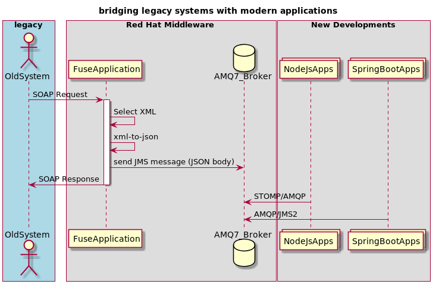
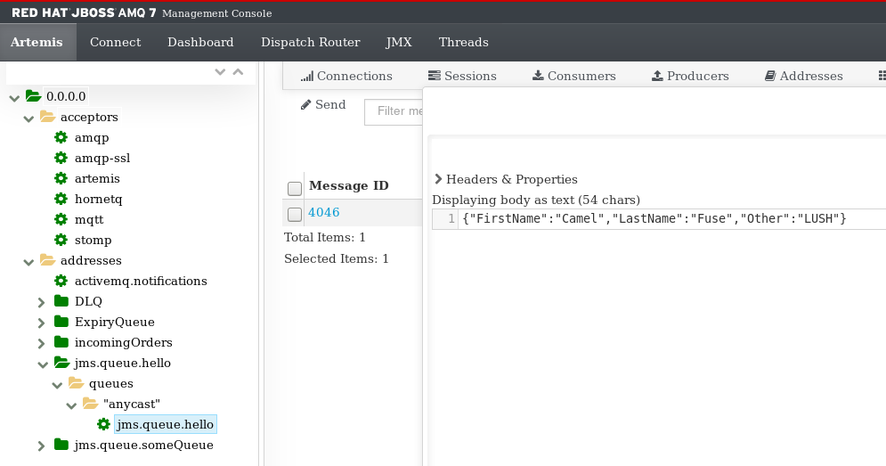

# cxf-soap-wsdlonly-to-json

This is an example use-case where a webservice is required to bridge legacy and modern systems, by way of using Fuse and AMQ7 to bridge them.



No JAXB Marshalling, just a plain SOAP body to JSON.  All in two neat camel routes.

```java
        from("cxf://" + webserviceName + "?wsdlURL=" + webserviceWsdlUrl + "&dataFormat=RAW&serviceName=" + webserviceServiceName + "&endpointName=" + webserviceEndpointName).routeId("cxfRoute")
                .setBody(ns.xpath(webserviceXpath))
                .log("XML body is ${body}")
                .marshal(xmlJsonFormat)
                .convertBodyTo(String.class)
                .log("Body to go to AMQ is ${body}")
                .to("direct:sendToJms")
                .setBody(simple(webserviceSimpleResponse))
                .setHeader("Content-Type", constant("application/xml"))
                .log("Body returned to WS-Client is ${body}");

        from("direct:sendToJms").routeId("jmsSend")
                .setExchangePattern(ExchangePattern.InOnly)
                .removeHeaders("*", "breadcrumbId")
                .to("{{artemis.destination}}");
```

This application can be configured to any WSDL.  It uses the [camel-xmljson dataformat](http://camel.apache.org/xmljson.html) in order to marshall xml to json.

## Application Configuration (application.yml)

The artemis section configures the connection to the JBoss AMQ7 broker, `destination` being the queue where the json will to sent to.

The cxf section configures the webservice, the wsdl exists in this project for simplicity, however, it can exist outside and referenced via `file://some/file/location/wsdl/simpleService.wsdl`.  
`serviceName`, and `endpointName` need to be specified as per the [camel-cxf component documentation](https://github.com/apache/camel/blob/master/components/camel-cxf/src/main/docs/cxf-component.adoc)

```yaml
artemis:
  url: amqp://192.168.122.18:61616
  username: admin
  password: admin
  destination: jms:queue:hello
  useAnonymousProducers: false
  maxConnections: 5

cxf:
  webservice:
    name: SomeService
    serviceName: "{http://www.example.org/SimpleService/}SimpleService"
    endpointName: "{http://www.example.org/SimpleService/}SimpleServiceSOAP"
    wsdlUrl: "wsdl/simpleService.wsdl"
    namespaces:
          soap: "http://schemas.xmlsoap.org/soap/envelope/"
          sim: "http://www.example.org/SimpleService/"
    xpath: "//soap:Body/sim:NewOperation"
    simpleResponse: "resource:classpath:static/response.xml"
```


## Running the application

A prerequisite is having the [AMQ Broker 7.2 installed and running](https://developers.redhat.com/products/amq/download/), ensure it is configured, and the application is configured via the `application.properties` and run:

```text
mvn clean package spring-boot:run
```


## Input and Output

SOAP request in:

```xml
<soapenv:Envelope xmlns:soapenv="http://schemas.xmlsoap.org/soap/envelope/" xmlns:sim="http://www.example.org/SimpleService/">
    <soapenv:Header/>
    <soapenv:Body>
        <sim:NewOperation>
            <FirstName>Camel</FirstName>
            <LastName>Fuse</LastName>
            <Other>LUSH</Other>
        </sim:NewOperation>
    </soapenv:Body>
</soapenv:Envelope>
```

AMQ JSON out (will be in the queue `hello.queue`)

```json
{"FirstName":"Camel","LastName":"Fuse","Other":"LUSH"}
```

And this should be seen in the AMQ management console:



SOAP response received by web service client:

```xml
<soapenv:Envelope xmlns:soapenv="http://schemas.xmlsoap.org/soap/envelope/" xmlns:sim="http://www.example.org/SimpleService/">
    <soapenv:Header/>
    <soapenv:Body>
        <sim:NewOperationResponse>
            <out>OK</out>
        </sim:NewOperationResponse>
    </soapenv:Body>
</soapenv:Envelope>
```

## Unit testing and integration testing

To unit test the application locally, an embedded broker is created. To unit test, run the following:

```text
mvn clean test -Denvironment=local
```

To run integration tests connecting to the live AMQ Broker:
1. change the artemis.url value in the yaml file:
src/test/resources/application-{environment}.yml

NOTE: if the yaml file for the required environment that is running AMQ does not exist, please create it.

2. run:

```text
mvn clean verify -Denvironment={environment}
```

## Load testing the application

Siege can be used to load test and send many SOAP payloads to the application.  In order to do so, run the following:

```text
mvn clean spring-boot:run
siege --rc=.siegerc
```

Change the configuration in the `.siegerc` file.

## Points of Note

### JMS

There are multiple types of JMS libraries in the application, why?

- AMQ7 artemis client libraries in the main application: org.messaginghub/pooled-jms/${pooled.jms.version} and org.apache.qpid/qpid-jms-client/${qpid.jms.client.version}
- AMQ5.x libraries in the unit test (broker and client): SoapToJsonUnitTest.java uses org.apache.activemq/activemq-broker/5.11.0.redhat-630371

The unit test spins up an in-memory broker and overrides the client jms configuration in order to use that embedded in-memory broker.


### Unit Testing with RestTemplate

SOAP testing.  Effectively a SOAP client is a HTTP Post with a specific SOAPAction header.  The Unit Test test the service as that also.

```java

    HttpHeaders headers = new HttpHeaders();
    headers.setContentType(MediaType.APPLICATION_XML);
    headers.set("SOAPAction", "http://www.example.org/SimpleService/NewOperation");

    HttpEntity<String> entity = new HttpEntity<String>(soapRequest, headers);
    //HttpEntity
    ResponseEntity<String> response = restTemplate.postForEntity("/services/SomeService", entity, String.class);

```

## Setting up the AMQ7 Broker.

- Download from Jboss Portal
- Follow the install documentation :)

### Generating keystores and truststores with OpenSSL and keytool
 
 ```text
 # Create a broker key and cert - import the keypair and cert into the broker keystore
 openssl req -newkey rsa:2048 -nodes -keyout broker_keypair.pem -x509 -days 65000 -out broker_cert.pem
 openssl pkcs12 -inkey broker_keypair.pem -in broker_cert.pem -export -out broker_ks.p12
 
 # Create a client key and cert - import the keypair and cert into the client keystore
 openssl req -newkey rsa:2048 -nodes -keyout client_keypair.pem -x509 -days 65000 -out client_cert.pem
 openssl pkcs12 -inkey client_keypair.pem -in client_cert.pem -export -out client_ks.p12
 
 # Create a truststore for the broker, and import the client's certificate. This establishes that the broker "trusts" the client:
 keytool -import -alias client -keystore broker_ts.p12 -file client_cert.pem -deststoretype pkcs12
 
 # Create a truststore for the client, and import the broker's certificate. This establishes that the client "trusts" the broker:
 keytool -import -alias broker -keystore client_ts.p12 -file broker_cert.pem -deststoretype pkcs12
```

The above keystores and truststores were created and given the password `password`


### Configure the broker.xml acceptor

The `broker_ks.p12` and `broker_ts.p12` files should reside in the `$BROKER_HOME/etc` directory.

```xml
<!-- AMQPS Acceptor.  Listens on default AMQPS port for AMQPS traffic.-->
<acceptor name="amqp-ssl">tcp://0.0.0.0:5671?tcpSendBufferSize=1048576;tcpReceiveBufferSize=1048576;protocols=AMQP;useEpoll=true;amqpCredits=1000;amqpMinCredits=300;connectionsAllowed=1000;sslEnabled=true;keyStorePath=broker_ks.p12;keyStorePassword=password;trustStorePath=broker_ts.p12;trustStorePassword=password</acceptor>
```

### Configure the client

The url by which the client connects needs to have the path to the trustStore, example below:

```yaml
artemis:
  url: amqps://localhost:5671?transport.trustStoreLocation=/home/user/AppServers/examplebroker/etc/client_ts.p12&transport.trustStorePassword=password&transport.verifyHost=false&jms.sendTimeout=5000
  username: theuser
  password: Thepassword1!
```

Once both broker and client are configured correctly, and the application is running against the broker, then the client log should display the following:

```text
2019-04-16 12:31:54.624  INFO 19120 --- [0.0-8080-exec-1] cxfRoute                                 : Body to go to AMQ is {"FirstName":"Camel","LastName":"Fuse","Other":"asdasdasdasdasd"}
2019-04-16 12:31:55.792  INFO 19120 --- [localhost:5671]] o.a.qpid.jms.sasl.SaslMechanismFinder    : Best match for SASL auth was: SASL-PLAIN
2019-04-16 12:31:55.850  INFO 19120 --- [localhost:5671]] org.apache.qpid.jms.JmsConnection        : Connection ID:5ed21a51-0b0e-44b2-b89f-2c7a9d99c126:1 connected to remote Broker: amqps://localhost:5671
```

### SSL

To secure the webservice, we need to enable ssl. This can be done via configurations on the application. Please see the following extract of application.yml:

```text
server:
  address: 0.0.0.0
  ssl:
    key-store: classpath:certs/baeldung.p12
    key-store-type: pkcs12
    key-store-password: baeldung
    key-alias: baeldung
security:
  require-ssl: true
```

To create the necessary keystore, please note:

        - It is recommended to use the PKCS12 format which is an industry standard format. We can use the following command to generate our PKCS12 keystore format:
        
        keytool -genkeypair -alias {alias} -keyalg RSA -keysize 2048 -storetype PKCS12 -keystore {keystore_name}.p12 -validity 3650
        
        - If there is an existing keystore in JKS format, please use the following command to convert to PKCS12
        
         keytool -importkeystore -srckeystore {old_keystore_name}.jks -destkeystore {new_keystore_name}.p12 -deststoretype pkcs12
         
NOTE: Save the chosen keystore password
  

## Further Documentation

- https://access.redhat.com/documentation/en-us/red_hat_fuse/7.2/
- https://access.redhat.com/documentation/en-us/red_hat_fuse/7.2/html/deploying_into_spring_boot/index
- https://access.redhat.com/documentation/en-us/red_hat_amq/7.2/html-single/using_the_amq_jms_pool_library
- https://camel.apache.org/cxf.html
- https://github.com/apache/camel/blob/master/components/camel-cxf/src/main/docs/cxf-component.adoc
- [Red Hat Jboss AMQ Supported configurations](https://access.redhat.com/articles/2791941)
